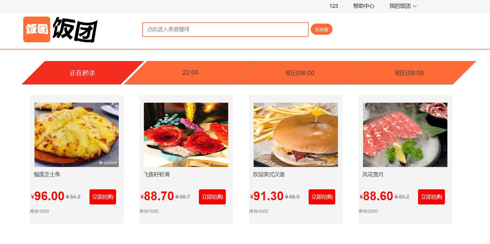
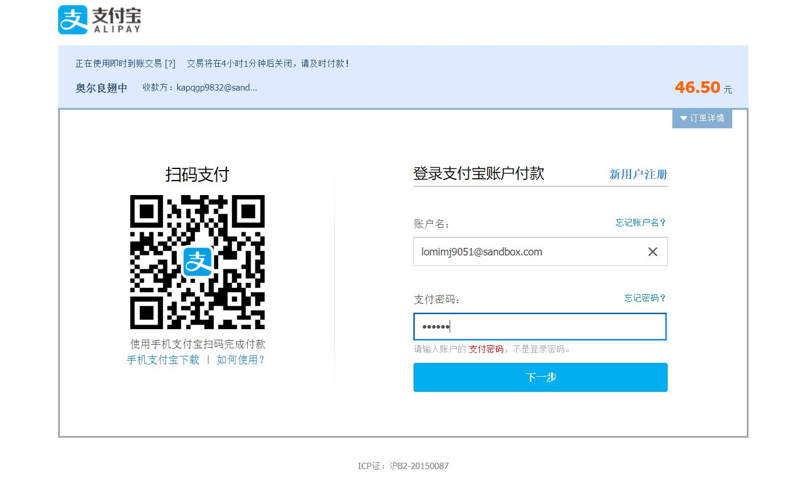
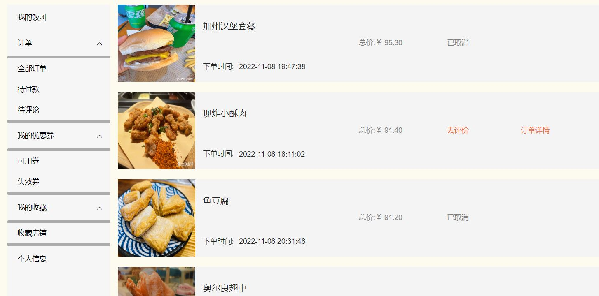
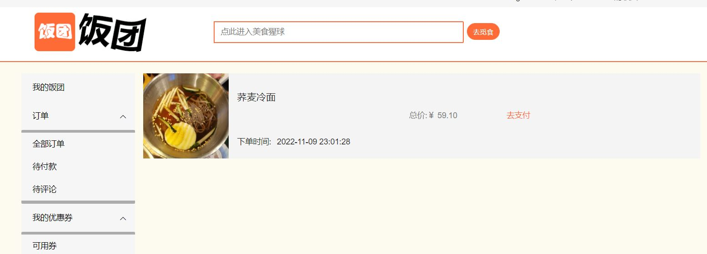

**项目简介**

饭团是仿照大众点评开发的一款美食点评项目，用户注册登录后根据商品类型、价格、店铺信息等多条件进行筛选店铺，在店铺详情页可以定位店铺的具体位置和收藏店铺。用户可以在饭团店铺中挑选美食以及参加秒杀低价抢购美食。在购买美食时用户可以在店铺内领取此店铺专享优惠券进行优惠减价。用户通过支付宝付款成功后可以查看到订单流水信息，也可以在个人中心查看订单的状态，包括已完成订单，待支付订单以及待评价订单。用户在筛选、浏览店铺时也可以对喜欢的店铺进行收藏，在个人中心中也可以查看。

**项目收获**

**软件架构说明**

该项目使用的框架时Spring Boot2.7.4

持久层由 Mybatis-Plus 逆向工程生成

数据库 MySQL 8.0.23

**使用的技术**

Mybatis-Plus、阿里云OSS存储、ElasticSearch 、IK分词器、Redis、thymeleaf、RSA、 AES、 sha2 短信注册、支付宝沙箱支付、RabbitMQ、JWT

**系统要求**

JDK:1.8

MySQL: 8.0

Redis:6.2

ES :8.0+

####  项目功能介绍

1. 注册登录
       使用RSA+AES+sha2+短信注册，全程保证保证用户的信息安全。

2. 根据美食类型、价格多条件筛选店铺
       用户根据美食类型和价格范围多个条件筛选美食店铺。

3. 根据店铺人均消费价格、店铺评分进行排序
       根据店铺的人均消费价格和店铺的评分对店铺进行排序。

4. 根据店铺信息搜索店铺
     根据店铺信息使用ElasticSearch进行查询；

5. 收藏店铺
    当用户搜索浏览店铺时对感兴趣的店铺进行收藏，收藏后的店铺可在个人中心-我的收藏-收藏店铺中查看。
    
    

6. 查看店铺位置地图
       这里调用了高德地图的接口显示店铺的位置； 

7.领取优惠券
          用户可以进入店铺，并领取当前店铺的优惠券，若优惠券超时未使用则失效。 

8. 商品秒杀
       使用redis完成秒杀功能，用户可参与每天固定时间段的秒杀活动进行低价抢购美食。

9.使用优惠券
         在购买商品时选择使用优惠券进行价格减价。 

10.提交、生成订单、削峰限流、支付延时，自动取消
          购买且完成优惠券的选择后提交订单进行购买,在此处使用了RabbitMQ实现了订单削峰限流与支付延迟，当订单超时未支付时订单自动取消。

11. 支付宝支付
           调用支付宝接口,使用支付宝沙箱进行支付生成流水。

12. 评论订单
          完成支付后生成订单，在个人中心查看订单去进行订单评价。

13. 个人中心
          用户登录成功后可在个人中心查看订单、优惠券、收藏、个人信息功能。具体包括订单的全部订单，待评论订单、未付款订单。优惠券包括已领取的优惠券、失效的优惠券。收藏的店铺和用户个人信息。
    

